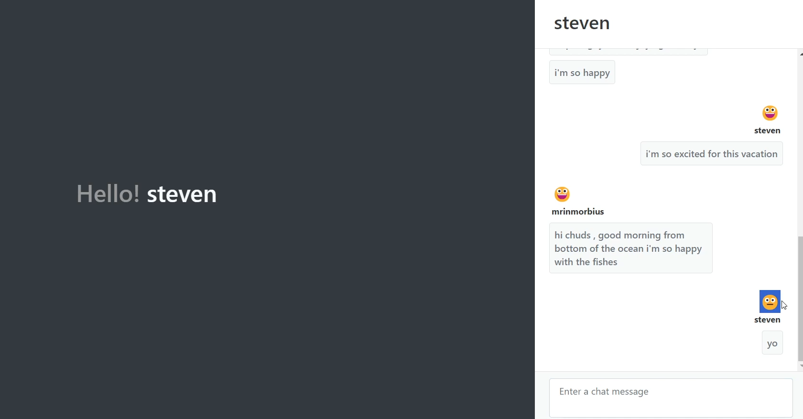

# Chat App with Sentiment Analysis

This is a chat application that incorporates sentiment analysis to analyze the sentiment of the messages exchanged between users. It provides insights into the emotional tone of the conversations.

## Features

- Real-time chat functionality
- Sentiment analysis of messages
- User-friendly interface

## Technologies Used

- Node.js
- react/next
- Pusher
- Sentiment API

## environment variables

- make a pusher account and get your app id, key, secret and cluster

PUSHER_APP_ID=your_id
PUSHER_APP_KEY=your_key
PUSHER_APP_SECRET=your_secret
PUSHER_APP_CLUSTER=your_cluster

## Contributing

Contributions are welcome! If you find any issues or have suggestions for improvements, please open an issue or submit a pull request.

## License

This project is licensed under the [MIT License](LICENSE).
